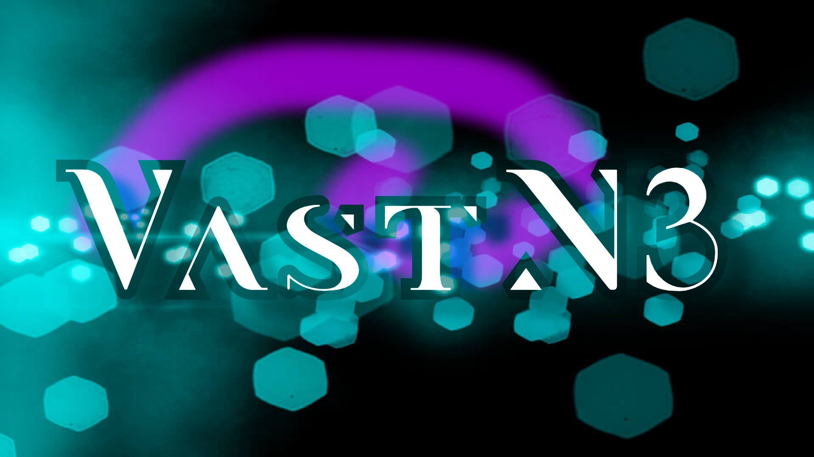

# vast-n3 

## Table of Contents

* [About the Project](#about-the-project)
  * [Built With](#built-with)
* [Getting Started](#getting-started)
  * [Prerequisites](#prerequisites)
  * [Installation](#installation)
* [Usage](#usage)
* [License](#license)
* [Contact](#contact)

## About the Project

Ever since JavaScript frontend solutions have become dominant, shops, blogs and all other businesses
requiring a fighting chance on the search engine listings had to make decisions between SEO and ease of use.
Countless JS-only solutions like next or nuxt tried to fill that hole.

However, all companies using these solutions have a story to tell about how these solutions become untamable
when dealing with bigger projects.

**Status** 

This is an early version of vast-n3 v2. Use at your own discretion.

### Built With

- [neoan3](https://neoan3.rocks)
- [Gaudiamus](https://gaudiamus-css.github.io/)
- [VueJS](https://vuejs.org/)

## Getting Started

### Prerequisites

- PHP
- Composer
- GIT
- neoan3 cli

### Installation

For now, it is recommended to fork this project and then clone it.
Run `composer install` and `yarn install`

We will provide updates to this process as soon as possible.

## Usage

After checking out the repository, make sure you have the newest version of neoan3 cli installed
(`composer global require neoan3/neoan3`).

Navigate to the project folder in your terminal and start with

`neoan3 develop`

Additionally to the regular cli commands for adding api endpoints, frames & models, this repository
ships with a local php-command for generating interpreted vue-components:

`php vue [name]` e.g. `php vue myComponent`

_The store_

Instead of using solutions like vuex, consider the provided object store in order to let the framework decide
whether API calls need to be made in order to retrieve information, or whether information is prerendered and therefore
already existing.

To do so effectively, please explore the store array in /frame/VastN3/VastN3.php, and it's usage in /component/Products/ProductsController.php

_customize_

You will find Gaudiamus settings in the frame's css folder. If you do not have a local watcher or scss compiler,
you can set the variable $compileScss in the output method of /frame/VastN3/VueRenderer to true (Warning: this will slow down rendering quite a bit)

## License

Beyond license(s) concerning this project, the following tools/libraries hold their respective licenses: 
- neoan3 cli [GNU AFFERO GENERAL PUBLIC License](https://github.com/neoan3/cli/blob/master/LICENSE)
- neoan3 framework [MIT License](https://github.com/sroehrl/neoan3/blob/master/LICENSE)

_MAINTAINER: We are looking for contributors_

## Contact

Feel free to join the [neoan3 discord server](https://discord.gg/WeyS567)